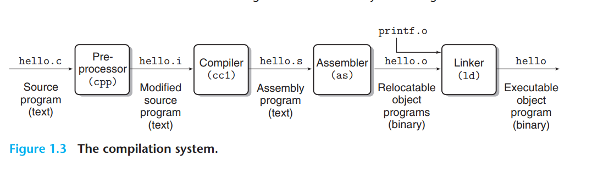
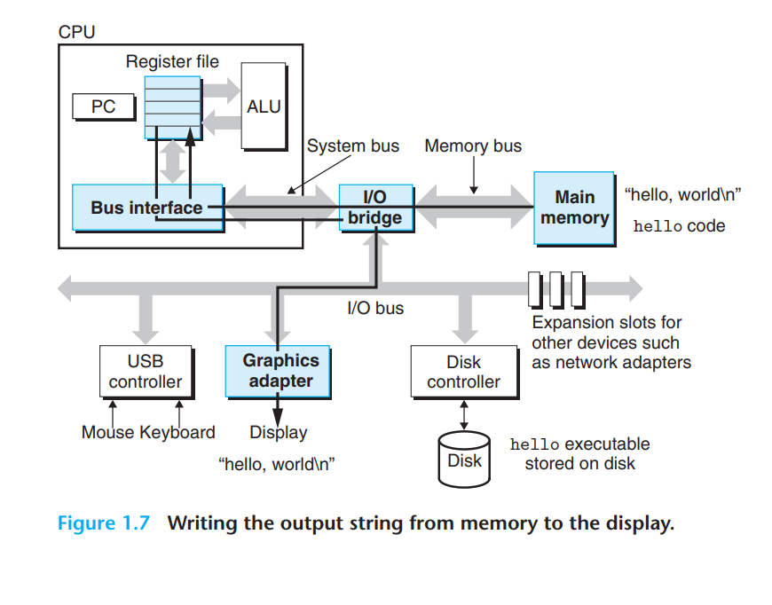

# CSAPP学习笔记







# 信息的表示与处理

## 2’s complement representation
计算二进制补码的一个非常方便的方法是$(b_{i}b_{i-1}b_{i-2}...b_0)_B = -2^{i}*b_{i}+2^{i-1}*b_{i-1}+2^{i-2}*b_{i-2}+...+2^0*b_0$
## `signed int`和`unsigned int`
### Umax, Umin, Tmax, Tmin
w位的位模式，作为unsigned int，最大值Umax为11...1，最小值Umin为0；作为signed int，最大值Tmax为011...1，最小值Tmin为100...0
> Tmin的相反数还是Tmin

### 类型转换
在C中，当表达式同时出现`signed int`（即`int`）和`unsigned int`变量时，会自动将`signed int`转换为`unsigned int`
> `sizeof()`会返回一个`unsigned int`类型

以下程序会死循环，因为`i-sizeof(char)`为`unsigned int`类型，永远不小于0
```C
int i; // signed
for(i=10;i-sizeof(char)>=0;i--)
    foo();
```
